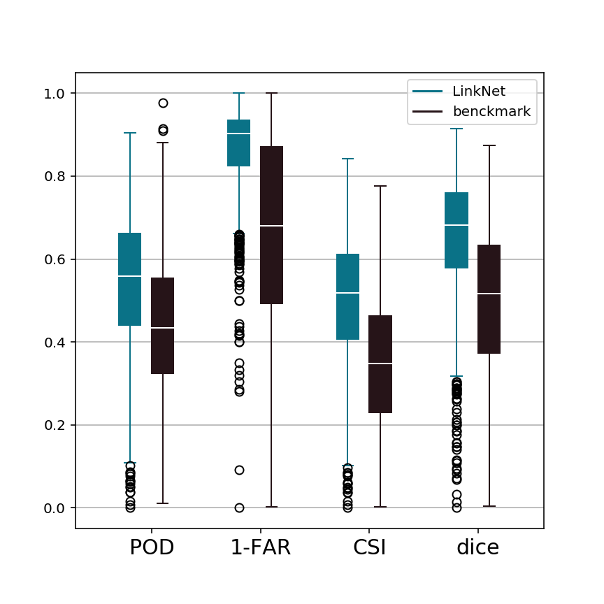
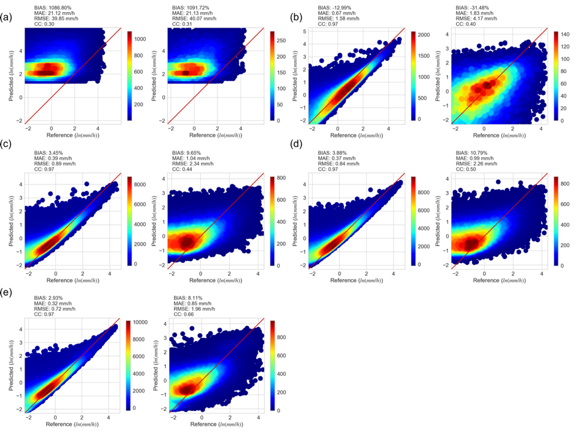
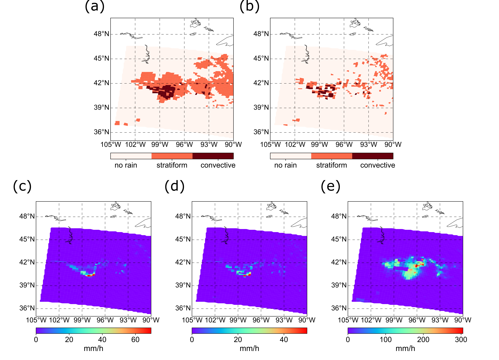
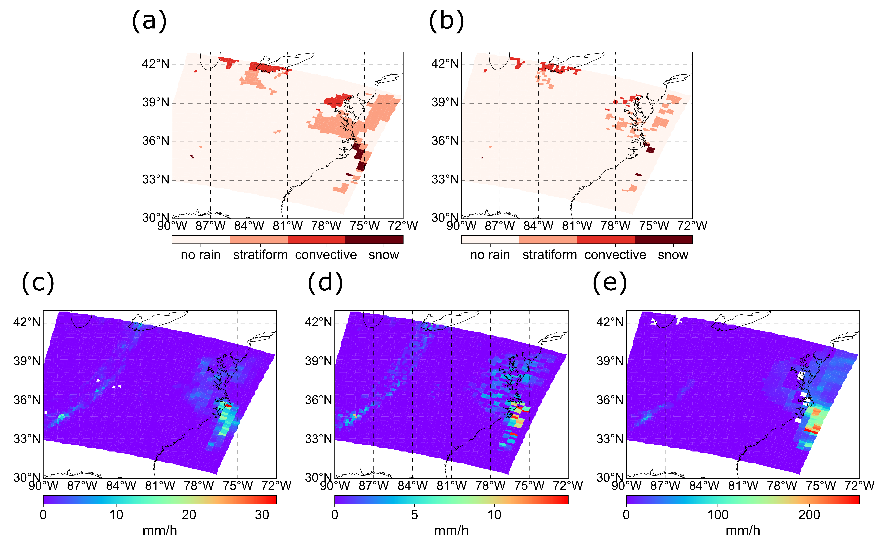

# Advancing satellite precipitation retrievals with data driven approaches: is black box model explainable?

## Contents

### 1. [Introduction](#introduction)

#### 1.1 [AMSU](#amsu)

#### 1.2 [Precipitation retrieval](#retrieval)

### 2. [Experiment design](#experiment)

### 3. [Results](#results)

#### 3.1 [Precipitation classification](#classification)

#### 3.2 [Precipitation quantification](#quantification)

#### 3.3 [Case study](#case)

### 4. [Findings](#finding)

## _Introduction_

As we know, remote sensing satellite provides an unprohibitive scan across the globe. It is advantageous to incorporate
more satellite information to retrieve ground precipitation.

### __AMSU__

AMSU stands for Advanced Microwave Sounding Unit, onboard NOAA satellites. It was initially lanched in 1998, but there are subsequent missions. AMSU is a sounding
satellite, which is primarily designed to measure vertical atmospheric temperature to understand storm characteristics. But as an additional benefit, it can
also be used to retrieve precipitation rate based on its multi-band information. Previous attempts on precipitation retrievals were not very suscessful. For instance,
 the NOAA operational platform which uses old version of GPROF to approximate rainfall rate fail to give a resonable estimates. I guess that is why in GPM IMERG,
 AMSU is no longer used from satellite constellations.

 In this study, we want to explore the capacity of precipitation estimation of AMSU with some data-driven approach, and more importantly, is the black box model can be
 explained? If so, what can we use it to innovate or broaden our understanding of satellite precipitation.

Animation of AMSU cross-scan

Deficiencies of current AMSU-based algorithm are summarized as follows:

1. BT-RR relationship is not precise (see Fig.1). In light rain, brightness temperature literally spans from 15 to 30K.

2. "Parallax effect" means the vertical disalignment.

Fig.1 BT-RR scatter plot

### __Precipitation retrieval__

We innovate the precipitation retrievals with deep learning approaches. In this case, we adopt the LinkNet structure because it is light-weight and effective.
The LinkNet structure is as follows. the CNN-based model takes care of parallax effects because the spatial structure is reserved, let alone the encoding-decoding
 structure.

Fig.2 LinkNet model structure

## __Experiment design__

In our study, we select eight frequencies in AMSU which could best capture precipitation from all aspects (light, medium, and large). These eight raw data undergo
 LinkNet to first predict precipitaiton type because we want to make corresponding prediction of rates based on type (i.e., different types have totally different rates)
 and then each type of precipitation will be mapped by random forest taking BT as well as ancillary data (i.e., eight neighboring celss, surface types, DEM, azimuthal angle, and diurnals)
 After that, the rainfall rate is utimately produced. All the results are contrasted against NSSL MRMS radar product.

Fig.3 Processing Framework

## __Results__

Here, we present some of the results of our model, compared to benchmark (operational system) in terms of classification, quantification, and two case studies.

### Precipitation classification

Fig.4 Classification results

### Precipitation Quantification

Fig.5 Quantification results

### Case study

__CASE 1__: convective storm

Fig.5 Case 1

__CASE 2__: North American Blizzard

Fig.6 Case 2

